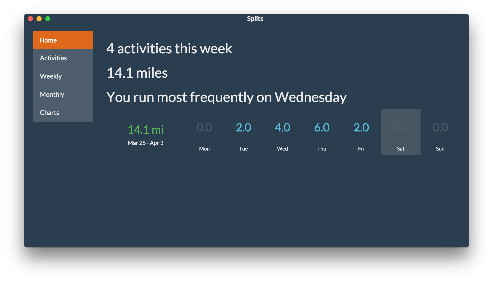
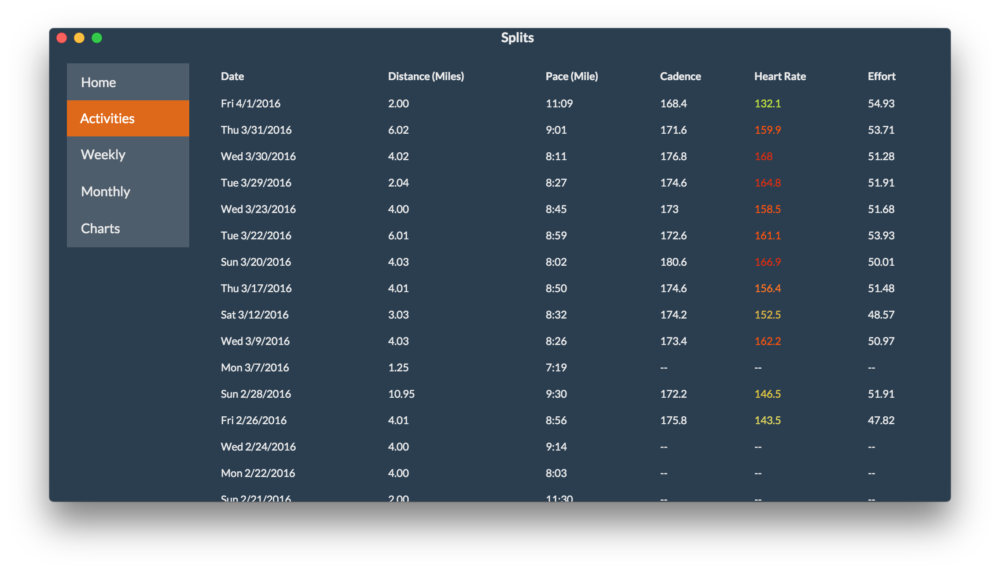

# Splits

Splits is an unofficial Strava-based performance analytics tool. Its primary purpose is for me to learn Ember.js, but if you find it useful for analyzing your training, that's great too.





# Config by:

1. Creating a file vendor/local_config.js
2. Filling it with the contents:

```
var gOptions = {
    access_key: 'xxx'
};
```

Where `'xxx'` is your access key from Strava. This is a temporary workaround until login is implemented.

## Installation

* `git clone <repository-url>` this repository
* change into the new directory
* `npm install`
* `bower install`

### Development & Running

* Use `ember build` to build the app. (Not for deployment, just for... building.)
* Use `ember test` to run the tests
* Use either `ember serve` to run in a browser, or `electron .` to run as an Electron standalone app [suh-weeeet]

# Using great code from:

- https://bootswatch.com/superhero/ [MIT]
- http://www.css-spinners.com/spinner/throbber [MIT]
